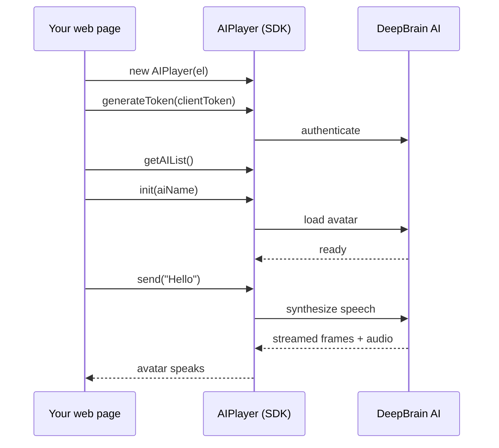

# AI Human Web SDK v2

**npm**으로 **실시간으로 말하는 AI 아바타**를 웹 페이지에 붙입니다. v2 SDK는 입력한 텍스트
(또는 LLM 응답)를 자연스러운 립싱크로 말하는 **2D 아바타**를 스트리밍합니다 — 영상 파이프라인도,
플러그인도 필요 없습니다.

`@deepbrainai/aihuman-web-sdk`를 설치합니다. 일상적으로 쓰는 `AIPlayer` API는 v1과 같습니다.
기존 v1 연동은 **[Web SDK v1](/aihuman/web-sdk)**에 그대로 둘 수 있습니다.

## Talk to AI Human

직접 해보세요 — 메시지를 입력하면 아바타가 실시간 립싱크로 말합니다. 이 데모는 실제 연동과 동일하게
배포된 SDK로 동작합니다.

{/* 데모는 배포된 ai-poc(dev). prod 문서 배포 시 prod ai-poc URL로 교체 */}
<iframe
  src="https://devai-poc.deepbrainai.io/sdk/v2/test?embed=1&modelId=sample-sage-v2"
  width="100%"
  height="620"
  allow="autoplay"
  style={{ border: "1px solid var(--ifm-color-emphasis-200)", borderRadius: "12px" }}
/>

## 왜 v2인가

- **npm.** `npm install @deepbrainai/aihuman-web-sdk` 후 `new AIPlayer(el)`로 시작.
- **실시간 발화.** 텍스트를 보내면 아바타가 립싱크로 스트리밍하며 말합니다.
- **첫 렌더 가속.** `enableEarlyStart`로 아바타를 더 빨리 표시.
- **모바일 자동 최적화.** 모바일에서는 idle 배경 다운로드를 자동으로 줄여 아바타가 더 빨리 나타납니다 —
  코드 변경 불필요.
- **익숙한 API.** 핵심 `AIPlayer` 클래스는 v1과 동일해 대부분의 호출이 그대로 이어집니다. (3D와
  custom‑voice API는 제거됨 — 아래 비교 표 참고.)

## 동작 방식

세션 JWT가 만료되면 플레이어는 화면에 두고, 새 ClientToken으로 `generateToken()`한 뒤
`reconnect()`하세요. SDK가 같은 세션을 이어붙입니다. `release()`는 사용자가 아바타를 끌 때만
호출하세요 — 다음 `init()`은 새 세션입니다.

## v1과의 차이

| | Web SDK v1 | Web SDK v2 |
| --- | --- | --- |
| 렌더링 | 2D / 3D | **2D 전용** |
| 배포 | CDN `aiPlayer-1.6.x.min.js` | npm `@deepbrainai/aihuman-web-sdk` |
| 커스텀 보이스 | 있음 | **제거** |
| 첫 렌더 가속 | — | `enableEarlyStart` |
| 모바일 idle 다운로드 | 전체 | **자동 축약** |
| API 표면 | `AIPlayer` 클래스 | 동일한 `AIPlayer` 클래스 |

## 다음 단계

  <a className="doc-card" href="./getting-started">
    
시작하기 →

    
npm 설치에서 첫 발화까지.

  </a>
  <a className="doc-card" href="./configuration">
    
설정 →

    
옵션과 튜닝.

  </a>
  <a className="doc-card" href="./apis/aiplayer">
    
AIPlayer API →

    
전체 메서드·콜백 레퍼런스.

  </a>

