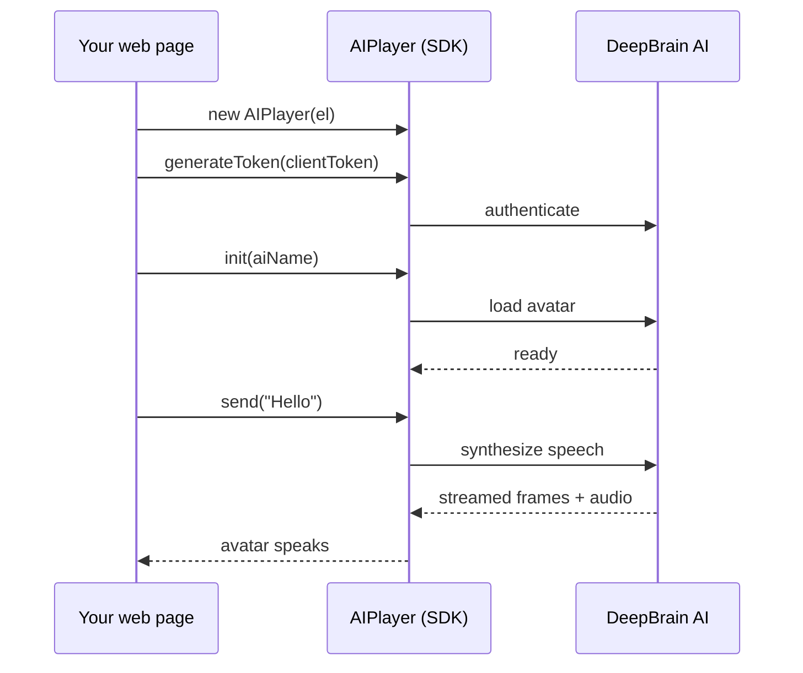

# AI Human Web SDK v2

스크립트 한 줄로 **실시간으로 말하는 AI 아바타**를 웹 페이지에 붙입니다. v2 SDK는 입력한 텍스트
(또는 LLM 응답)를 자연스러운 립싱크로 말하는 **2D 아바타**를 스트리밍합니다 — 영상 파이프라인도,
플러그인도 필요 없습니다.

:::info Beta
Web SDK v2는 **beta**입니다. 핵심 API는 안정적이며 v1 `AIPlayer` 클래스와 동일하고, 새 옵션
([설정](./configuration))은 아직 확정 중입니다.
:::

## 왜 v2인가

- **드롭인.** `<script>` 하나면 `AIPlayer` 클래스가 전역에 노출됩니다 — `new AIPlayer(el)`로 시작.
- **실시간 발화.** 텍스트를 보내면 아바타가 립싱크로 스트리밍하며 말합니다.
- **부드러운 재생.** `continuousBackground`로 발화 시작 시 배경 튐 제거, `enableEarlyStart`로 아바타를
  더 빨리 표시.
- **모바일 자동 최적화.** 모바일에서는 idle 배경 다운로드를 자동으로 줄여 아바타가 더 빨리 나타납니다 —
  코드 변경 불필요.
- **v1과 동일 API.** v1 Web SDK를 연동했다면 호출 방식이 그대로 이어집니다.

## 동작 방식

## v1과의 차이

| | Web SDK v1 | Web SDK v2 |
| --- | --- | --- |
| 렌더링 | 2D / 3D | **2D 전용** |
| 배포 파일 | `aiPlayer-1.6.x.min.js` | `aiPlayer-2.x.obf.js` |
| 배경 연속성 | — | `continuousBackground` (beta) |
| 첫 렌더 가속 | — | `enableEarlyStart` (beta) |
| 모바일 idle 다운로드 | 전체 | **자동 축약** |
| API 표면 | `AIPlayer` 클래스 | 동일한 `AIPlayer` 클래스 |

## 다음 단계

- **[시작하기](./getting-started)** — 빈 HTML에서 첫 발화까지.
- **[설정](./configuration)** — 옵션과 튜닝.
- **[AIPlayer API](./apis/aiplayer)** — 전체 메서드·콜백 레퍼런스.
