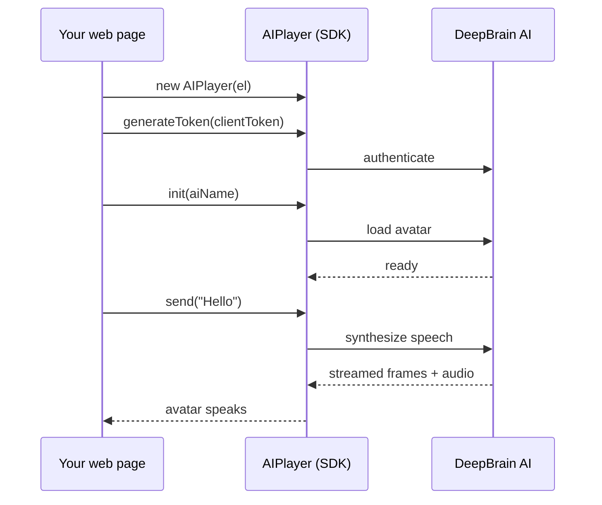

# AI Human Web SDK v2

Add a **real‑time, talking AI avatar** to any web page with a single script. The v2 SDK streams a
2D avatar that speaks your text (or LLM responses) with natural lip‑sync — no video pipeline, no
plugins.

:::info Beta
Web SDK v2 is in **beta**. The core API is stable and mirrors the v1 `AIPlayer` class; newer options
(see [Configuration](./configuration)) are still being finalized. For the current stable release, see
**[Web SDK v1](/aihuman/web-sdk)**.
:::

## Talk to AI Human

Try it live — type a message and the avatar speaks it back with real‑time lip‑sync. This demo runs on
the published SDK exactly as you would integrate it.

{/* 데모는 배포된 ai-poc(dev). prod 문서 배포 시 prod ai-poc URL로 교체 */}
<iframe
  src="https://devai-poc.deepbrainai.io/sdk/v2/test?embed=1&modelId=sample-sage-v2"
  width="100%"
  height="620"
  allow="autoplay"
  style={{ border: "1px solid var(--ifm-color-emphasis-200)", borderRadius: "12px" }}
/>

## Why v2

- **Drop‑in.** One `<script>` tag exposes the `AIPlayer` class — `new AIPlayer(el)` and go.
- **Real‑time speech.** Send text and the avatar speaks it back with lip‑sync, streaming.
- **Smoother playback.** Optional `continuousBackground` removes the background jump when speech
  starts; `enableEarlyStart` shows the avatar sooner.
- **Mobile‑optimized automatically.** On phones the SDK trims the idle background download so the
  avatar appears faster — no code change required.
- **Familiar API.** The core `AIPlayer` class mirrors v1 — most calls carry over. (3D and
  custom‑voice APIs are removed; see the comparison below.)

## How it works

## What's different from v1

| | Web SDK v1 | Web SDK v2 |
| --- | --- | --- |
| Rendering | 2D / 3D | **2D only** |
| Distribution | `aiPlayer-1.6.x.min.js` | `aiPlayer-2.x.obf.js` |
| Background continuity | — | `continuousBackground` (beta) |
| Faster first render | — | `enableEarlyStart` (beta) |
| Mobile idle download | full | **auto‑trimmed** |
| API surface | `AIPlayer` class | same `AIPlayer` class |

## Next steps

  <a className="doc-card" href="./getting-started">
    
Getting Started →

    
From empty HTML to first speech.

  </a>
  <a className="doc-card" href="./configuration">
    
Configuration →

    
Options and tuning.

  </a>
  <a className="doc-card" href="./apis/aiplayer">
    
AIPlayer API →

    
Full method and callback reference.

  </a>

