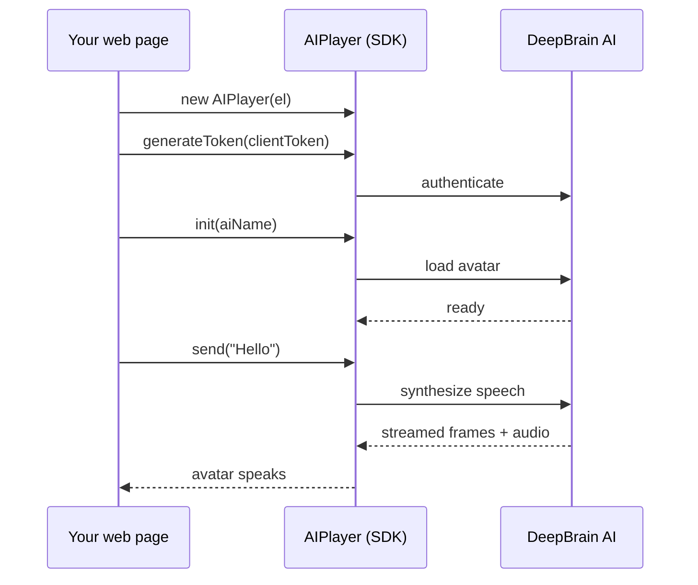

# AI Human Web SDK v2

Add a **real‑time, talking AI avatar** to any web page with a single script. The v2 SDK streams a
2D avatar that speaks your text (or LLM responses) with natural lip‑sync — no video pipeline, no
plugins.

:::info Beta
Web SDK v2 is in **beta**. The core API is stable and mirrors the v1 `AIPlayer` class; newer options
(see [Configuration](./configuration)) are still being finalized.
:::

## Why v2

- **Drop‑in.** One `<script>` tag exposes the `AIPlayer` class — `new AIPlayer(el)` and go.
- **Real‑time speech.** Send text and the avatar speaks it back with lip‑sync, streaming.
- **Smoother playback.** Optional `continuousBackground` removes the background jump when speech
  starts; `enableEarlyStart` shows the avatar sooner.
- **Mobile‑optimized automatically.** On phones the SDK trims the idle background download so the
  avatar appears faster — no code change required.
- **Same API as v1.** If you have integrated the v1 Web SDK, your calls carry over.

## How it works

## What's different from v1

| | Web SDK v1 | Web SDK v2 |
| --- | --- | --- |
| Rendering | 2D / 3D | **2D only** |
| Distribution | `aiPlayer-1.6.x.min.js` | `aiPlayer-2.x.obf.js` |
| Background continuity | — | `continuousBackground` (beta) |
| Faster first render | — | `enableEarlyStart` (beta) |
| Mobile idle download | full | **auto‑trimmed** |
| API surface | `AIPlayer` class | same `AIPlayer` class |

## Next steps

- **[Getting Started](./getting-started)** — from empty HTML to first speech.
- **[Configuration](./configuration)** — options and tuning.
- **[AIPlayer API](./apis/aiplayer)** — full method & callback reference.
